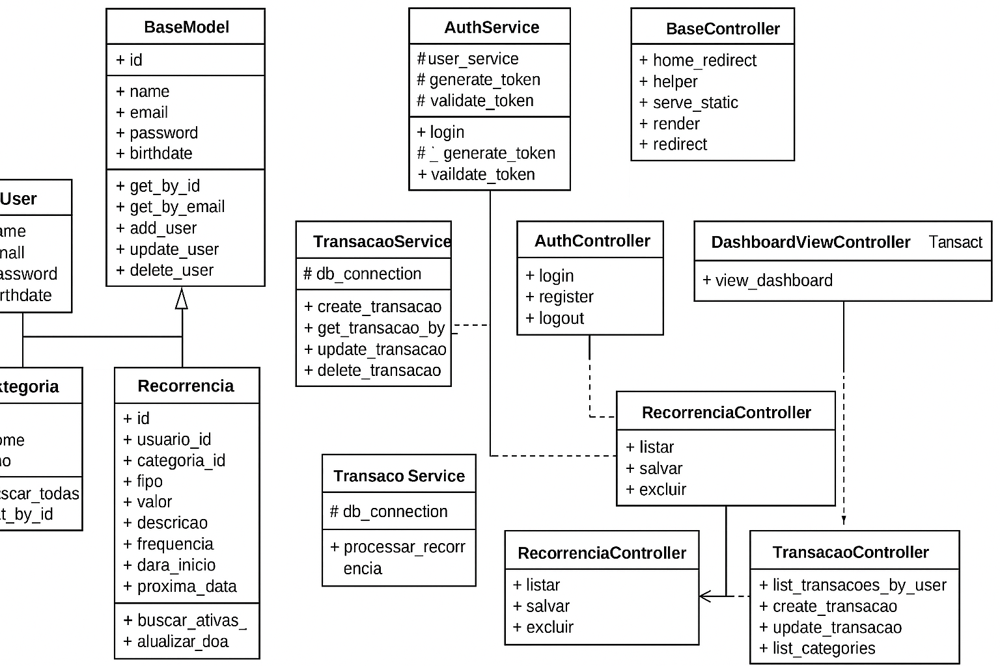

# EPF – Sistema Web com Persistência em SQLite3

Este projeto foi desenvolvido como parte do **EPF** da disciplina de Programação Orientada a Objetos, implementando um sistema web completo com autenticação, controle de usuários, transações, recorrências e estatísticas financeiras.

A aplicação segue uma arquitetura organizada em camadas (Models, Services, Controllers e Views) e utiliza o framework **Bottle** com **SQLite3** como banco de dados principal.

---

## 📌 Visão Geral da Solução

A aplicação implementa um sistema financeiro simplificado, permitindo que usuários realizem:

- Cadastro e login  
- Registro de transações  
- Registro de recorrências  
- Consultas de estatísticas  
- Visualização de dados por meio de páginas HTML  

Toda a lógica de persistência utiliza um banco SQLite armazenado em `data/app_database.db`.

Além disso, algumas partes do projeto mantêm compatibilidade com dados JSON (como `users.json`), embora o banco principal seja o SQLite.

---

## 🧩 Funcionalidades

### ✔️ Autenticação
- Login e criação de conta
- Hash seguro de senhas (`password_utils.py`)
- Middleware de autenticação (`auth_middleware.py`)

### ✔️ Usuários
- CRUD de usuários
- Armazenamento no banco SQLite
- Verificação de credenciais

### ✔️ Transações
- Registro de entradas e saídas
- Edição e exclusão
- Listagem filtrada

### ✔️ Recorrências
- Criação de transações recorrentes
- Processamento automático via serviço dedicado

### ✔️ Estatísticas
- Cálculo de totais, médias e soma de transações
- Dashboards simples exibidos via HTML

### ✔️ Banco de dados
- Armazenado em `data/app_database.db`
- Criado automaticamente caso não exista
- Gerenciado via `models/database.py`

---

## 📁 Estrutura de Pastas
```bash
EP3-Pedro-Luca-e-Vinicius-Araruna/
├── app.py # Configuração principal e inicialização do Bottle
├── main.py # Ponto de entrada da aplicação
├── config.py # Configurações globais (banco, paths, chaves)
├── requirements.txt # Dependências
├── Makefile # Comandos automatizados (opcional)
│
├── data/
│ ├── app_database.db # Banco SQLite principal
│ └── users.json 
│
├── models/
│ ├── base_model.py
│ ├── categoria.py
│ ├── transacao.py
│ ├── recorrencia.py
│ ├── user.py
│ └── database.py # Conexão com SQLite
│
├── services/
│ ├── auth_service.py # Login / registro
│ ├── user_service.py # CRUD de usuários
│ ├── transacao_service.py # Serviço de transações
│ ├── recorrencia_service.py # Serviço de recorrências
│ └── estatisticas_service.py # Cálculo de relatórios
│
├── utils/
│ ├── auth_middleware.py # Middleware de proteção de rotas
│ └── password_utils.py # Hash / verificação de senhas
│
├── controllers/ # Rotas da aplicação
│
├── views/ # Templates HTML (Bottle)
│
└── static/
├── css/
├── js/
└── img/
```

---

## 🗃️ Banco de Dados – SQLite3

A aplicação utiliza um banco SQLite localizado em:
data/app_database.db

## 🔧 Instalação e Execução

### 1. Clone o repositório

```bash
git clone https://github.com/pedrolrm/EP3-Pedro-Luca-e-Vinicius-Araruna.git
cd EP3-Pedro-Luca-e-Vinicius-Araruna
```
### 2. Crie um ambiente virtual
```bash
python -m venv venv
venv/Scripts/activate  # Windows
# ou
source venv/bin/activate  # Linux/Mac
```
### 3. Instale as dependências
```bash
pip install -r requirements.txt
```

### 4. Execute a aplicação
```bash
python main.py
```

### 5. Abra o navegador
```bash
http://localhost:8080
```


🔐 Autenticação

O fluxo de autenticação funciona assim:

O usuário insere email e senha

auth_service.py valida credenciais

A senha é verificada usando hash (password_utils.py)

Um token simples de sessão é gerado e salvo via cookies

Rotas protegidas são verificadas pelo middleware auth_middleware.py

## Diagrama de Classes




Equipe

Pedro Luca

Vinícius Araruna

